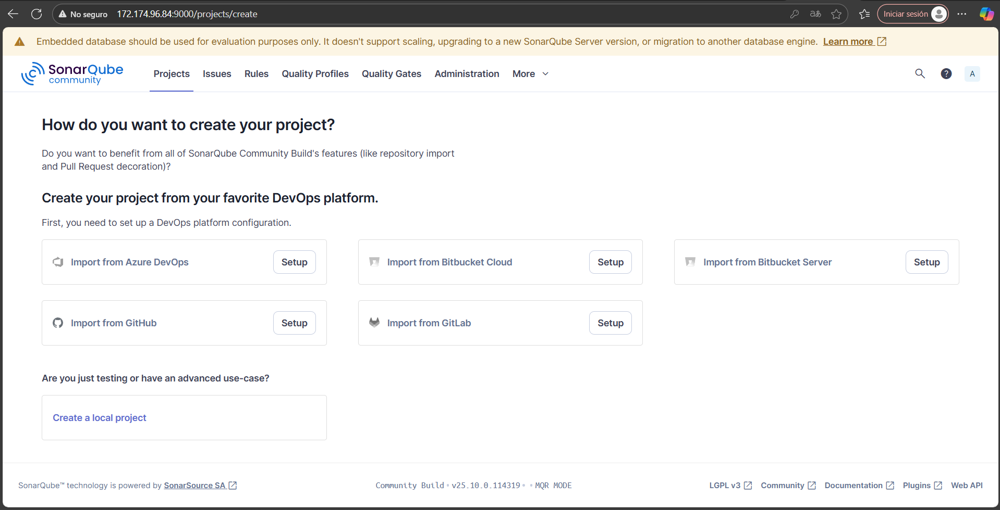
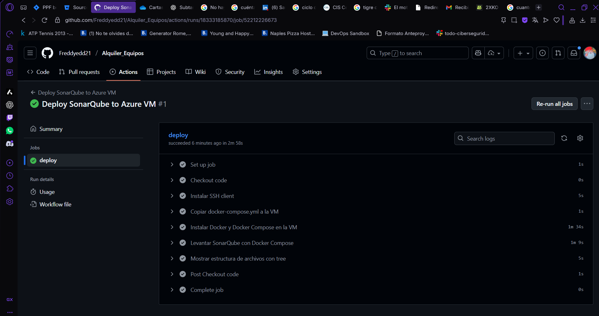
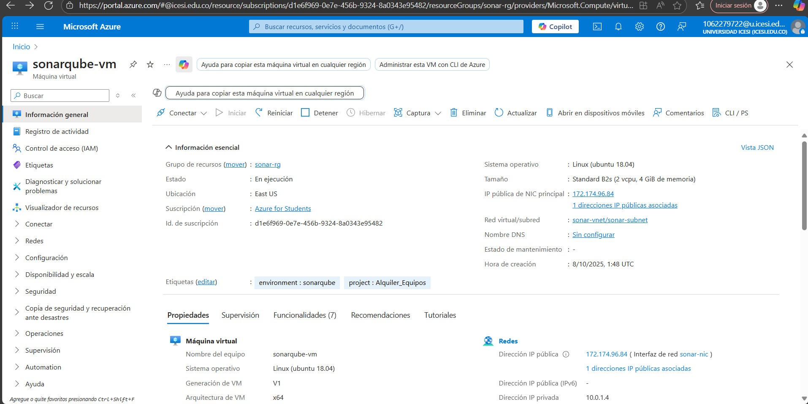
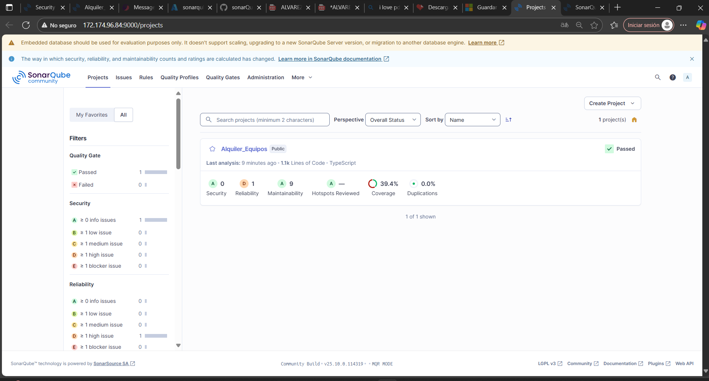

# Alquiler_Equipos

## Resumen del proceso realizado

1. **Configuración de SonarQube y cobertura**
	- Se instaló y configuró SonarQube usando Docker y PostgreSQL.
	- Se conectó el proyecto a SonarQube para análisis automático de calidad y cobertura de código.
	- Se generó el reporte de cobertura con Jest y se integró en el pipeline para que SonarQube lo muestre.

2. **Automatización con GitHub Actions**
	- Se creó un workflow que ejecuta los tests y el análisis de SonarQube en cada push.
	- Se configuraron los secretos para conectar el pipeline con el servidor SonarQube.

3. **Provisionamiento en Azure**
	- Se desplegó SonarQube en una máquina virtual de Azure usando Terraform.
	- Se configuró la VM con acceso por contraseña y reglas de red para permitir el acceso al servidor.

4. **Depuración y limpieza de tests**
	- Se eliminaron los tests que fallaban para asegurar que el pipeline y la cobertura funcionen correctamente.
	- Se validó que los tests restantes pasen y que la cobertura se reporte correctamente.

5. **Validación final**
	- Se revisó el reporte de cobertura y la integración con SonarQube.
	- El proyecto quedó listo para desarrollo continuo con análisis automático y despliegue en la nube.

